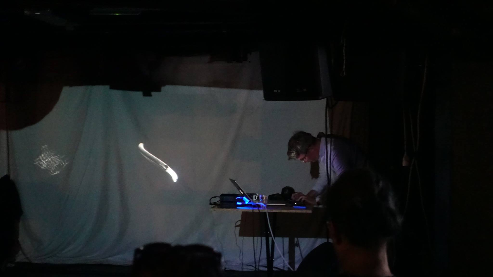

# DAF342wregsf live interface

__Photo by Merlyn Perez-Silva__

Live interface for the acousmatic sound distribution of the piece 'DAF342wregsf'
from 'States of Emergency' by Mads Kjeldgaard. The piece was originally released
on Conditional Records in 2018: http://shop.conditional.club/album/states-of-emergency

This script is to be used with the Korg NanoKontrol2 midi controller

More info: https://madskjeldgaard.dk

This was very much inspired by David Granström's [SuperPrism project](https://github.com/davidgranstrom/SuperPrism)
